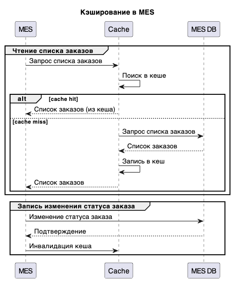

## Архитектурное решение по оптимизации работы MES

## Мотивация

Внедрение кеширования вызвано следующими проблемами в системе:

- **Низкая скорость загрузки страницы MES у операторов.** Операторы испытывают трудности с производительностью MES, особенно при загрузке первой страницы со списком заказов. Это замедляет их работу и снижает эффективность.
- **Длительное время выполнения заказов.** Клиенты жалуются на долгое ожидание выполнения заказов, что негативно сказывается на их удовлетворенности.

Кеширование призвано решить эти проблемы за счет:

- **Ускорения доступа к часто запрашиваемым данным.** Кеширование позволит хранить часто используемые данные, такие как список заказов или результаты расчета стоимости, в быстром хранилище, что значительно сократит время доступа к ним.
- **Снижения нагрузки на базу данных MES.** Благодаря кешированию, количество обращений к базе данных уменьшится, что снизит нагрузку на нее и повысит общую производительность системы.

В кеширование планируется включить следующие элементы системы:

- **Список заказов в MES.** Это наиболее часто запрашиваемая информация, кеширование которой существенно ускорит работу операторов.
- **Результаты расчета стоимости заказа.** Кеширование результатов расчета позволит избежать повторного выполнения длительных операций для одних и тех же заказов.

## Предлагаемое решение

Предлагается использовать **серверное кеширование** с паттерном **Cache-Aside**.

**Серверное кеширование** выбрано, потому что оно позволяет централизованно управлять данными и обеспечивает их консистентность для всех пользователей. Клиентское кеширование не подходит, так как данные о заказах и их стоимости должны быть согласованы между всеми операторами и системой в целом.

**Cache-Aside** является оптимальным паттерном в данном случае, так как он обеспечивает гибкость и контроль над процессом кеширования. При использовании Cache-Aside приложение сначала проверяет наличие данных в кеше. Если данные есть, они возвращаются из кеша. Если данные отсутствуют, приложение обращается к базе данных, получает данные, записывает их в кеш и затем возвращает. Этот паттерн хорошо подходит для данных, которые редко изменяются, что характерно для списка заказов и результатов расчета стоимости.

Паттерн **Write-Through** не подходит, так как он предполагает запись данных в кеш и базу данных одновременно, что может замедлить операции записи. В данном случае это нежелательно, так как скорость записи не является критичным фактором.

**Refresh-Ahead** также не является оптимальным, так как он предполагает предварительное обновление данных в кеше до того, как они будут запрошены. Это может привести к избыточному потреблению ресурсов, так как некоторые данные могут никогда не быть запрошены.

### Описание процесса кеширования

В процессе кеширования участвуют следующие сущности:

- **MES (клиент)**: инициирует запросы на чтение и запись данных.
- **Cache**: хранилище кешированных данных.
- **MES DB**: основная база данных MES.

**Чтение списка заказов:**

1. MES запрашивает список заказов.
2. Система проверяет наличие списка заказов в кеше.
3. Если список заказов присутствует в кеше (cache hit), он возвращается в MES.
4. Если список заказов отсутствует в кеше (cache miss), система обращается к MES DB.
5. MES DB возвращает список заказов.
6. Система записывает список заказов в кеш.
7. Список заказов возвращается в MES.

**Запись изменения статуса заказа:**

1. MES отправляет запрос на изменение статуса заказа.
2. Система обновляет статус заказа в MES DB.
3. Система инвалидирует соответствующую запись в кеше (если она там есть).

### Диаграмма последовательности действий

### Стратегия инвалидации кеша

В данном случае предлагается использовать комбинацию двух стратегий:

1. **Инвалидация по ключу (Key-based invalidation):**
    - Когда данные в базе данных изменяются, соответствующие записи в кеше инвалидируются по ключу.
    - Например, при изменении статуса заказа, запись с этим заказом в кеше удаляется по его ID.
    - Этот подход гарантирует, что устаревшие данные не будут возвращены из кеша.
2. **Временная инвалидация (Time-based invalidation, TTL):**
    - Каждой записи в кеше устанавливается время жизни (TTL).
    - По истечении TTL запись автоматически удаляется из кеша.
    - Это необходимо для того, чтобы данные в кеше не устаревали слишком сильно, даже если они не изменяются в базе данных.
    - Также это поможет распределить нагрузку на базу данных, предотвращая одновременное обращение к ней за всеми данными после истечения срока действия кеша.

**Почему выбрана эта стратегия:**

- **Комбинация инвалидации по ключу и TTL** обеспечивает как консистентность данных, так и производительность. Инвалидация по ключу гарантирует, что в кеше не будет устаревших данных, а TTL предотвращает слишком долгое хранение данных в кеше и распределяет нагрузку на базу данных.
- **Программная инвалидация** в данном случае не подходит, так как она требует сложной логики для отслеживания изменений данных и инвалидации кеша. Это может привести к ошибкам и усложнить систему.
- **Только временная инвалидация** не подходит, так как она не гарантирует консистентность данных. Данные в базе данных могут измениться, но в кеше останется устаревшая версия до истечения TTL.
